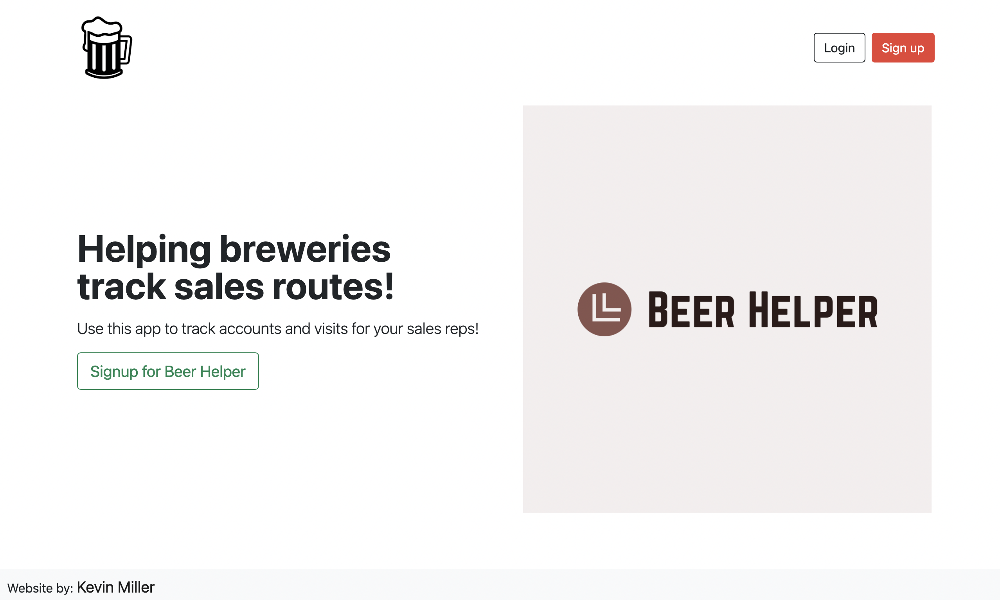

Beer-Helper

App for brewery sales teams to use to track accounts and visits.

Link to project: https://beer-sales-helper.herokuapp.com/

Demo User
email: tester1234@gmail.com
password: tester1234

How It's Made:
Tech used: HTML, CSS, JavaScript, Bootstrap, Node.js, Express.js, MongoDB

Optimizations:

Lessons Learned:
How to add functionality using the backend.  Implementation of MVC methods.  Using middleware such as mongoose and method override.  Use of bootstrap for styling and design.  # beer-helper
